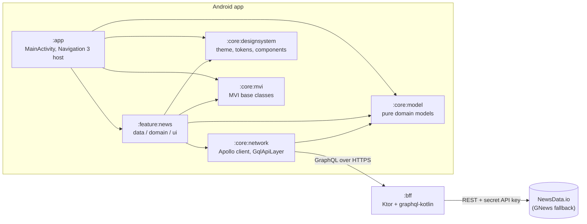

# Architecture

AI News is intentionally small — a news list, a detail screen, and a backend that feeds them —
so every layer can be fully built out, tested and documented. This file explains the structure
and the reasoning behind the main decisions.

## Big picture



The app never talks to the news provider directly: it queries a small Kotlin GraphQL server
(the BFF) over a single, stable schema, and the BFF talks to the provider's REST API.

## Module structure and dependency rules

The project is multi-module, split by feature with shared `:core:*` modules:

| Module | Contents |
| --- | --- |
| `:app` | `Application`, `MainActivity`, Navigation 3 wiring, Hilt entry point |
| `:feature:news` | The news feature: `data`, `domain` and ui (`list`, `detail`) packages |
| `:core:model` | Pure Kotlin domain models (`Article`, `ArticleSummary`) — no dependencies |
| `:core:mvi` | The MVI base: `UiState`, `Intent`, `Effect`, `MviViewModel` |
| `:core:network` | Apollo Kotlin 5 client, `GqlApiLayer`, `RequestResult`, GraphQL operations |
| `:core:designsystem` | Theme tokens, light/dark colors, reusable components |
| `:core:testing` | Shared test helpers |
| `:bff` | Standalone Kotlin GraphQL server (not part of the Android build) |
| `:benchmark` | Macrobenchmarks and the baseline-profile generator for `:app` |

Dependencies point in one direction only:

```
:app → :feature:* → :core:*
```

- `:core:model` depends on **nothing** — it is the innermost circle.
- Domain code (`:feature:news/domain`) depends only on `:core:model`, never on Apollo,
  Compose or any other framework.
- `:core:designsystem` is self-contained; feature UI reads every color, type style,
  spacing step and shape from its theme tokens instead of hard-coding values.

This is Clean Architecture's dependency rule applied with Gradle modules instead of just
packages: the build itself fails if an inner layer tries to reach outward.

## Layers inside the feature

`:feature:news` keeps the classic three layers as packages:

- **data** — `NewsRepositoryImpl` executes GraphQL operations through `GqlApiLayer` and
  `NewsMapper` converts generated GraphQL types into domain models (parsing dates into
  `Instant`, handling nullable fields). Apollo types never leave this layer.
- **domain** — `NewsRepository` (interface), `GetAiNewsUseCase`, `GetArticleUseCase` and
  `NewsError`. Plain Kotlin, trivially unit-testable.
- **ui** — `list` and `detail` packages, each holding an MVI contract, a pure reducer,
  a ViewModel and a stateless Compose screen.

The data layer returns a `RequestResult` (a small `Success`/`Error` sealed interface) instead
of throwing client-specific exceptions, so the layers above branch on a value rather than
catching `ApolloException`.

## MVI: UiState, Intent, Effect

Each screen is driven by a triad defined in `:core:mvi`:

- **UiState** — one immutable data class holding everything the screen renders
  (`NewsListState` carries the articles, loading/refreshing flags and the current error).
  The screen is a pure function of this state.
- **Intent** — every user or system action, funneled through the single
  `MviViewModel.onIntent` entry point (`Load`, `Refresh`, `Retry`, `ArticleClicked`, …).
- **Effect** — one-time events that must not replay on recomposition or configuration
  change: navigation, snackbars, opening an external URL. Effects flow through a
  `Channel`-backed stream, separate from state, so each is delivered exactly once.

State transitions live in **pure reducers** (`NewsListReducer`, `ArticleDetailReducer`) —
plain functions from old state to new state, tested without mocks. The ViewModel only
orchestrates: it receives an intent, calls a use case, applies a reducer, and emits effects.

Crucially, **ViewModels never navigate**. `ArticleClicked` becomes a `NavigateToDetail`
effect; the navigation host in `:app` collects it and mutates the back stack. This keeps
ViewModels free of any Android navigation types and makes "tap emits the right effect" a
one-line Turbine test.

```
user action ──Intent──▶ ViewModel ──▶ UseCase ──▶ Repository ──▶ GqlApiLayer
     ▲                     │
     │                     ├──setState(reducer)──▶ UiState ──▶ Compose screen
     └────── render ◀──────┘
                           └──sendEffect──▶ Effect ──▶ collected at the nav host
```

## Why Navigation 3

Navigation 3 makes the back stack a plain, observable list of typed keys that the app owns
(`NewsList`, `ArticleDetail(id)` — serializable objects, no string routes). That fits this
architecture unusually well:

- **It matches the MVI mindset.** Navigation state is just state. A `NavigateToDetail`
  effect becomes `backStack.add(ArticleDetail(id))` — an ordinary list mutation that tests
  can assert on directly.
- **Custom back-stack policies are trivial.** Selecting another article while a detail is
  already on top *replaces* the top entry instead of pushing, so back always returns to the
  list instead of walking through every viewed article (see `showDetail` in
  `AppNavigation.kt`). With a `NavController` this would fight the framework.
- **Adaptive layouts are first-class.** A custom `SceneStrategy` (`TwoPaneSceneStrategy`)
  renders list and detail side by side on expanded windows (tablets, unfolded foldables)
  and returns `null` on compact widths, falling back to the normal single-pane flow — same
  back stack, two presentations.

## The BFF's role

The `:bff` module is a small Ktor server exposing a GraphQL schema via graphql-kotlin
(code-first: Kotlin classes generate the schema). It exists for two reasons:

1. **It hides the API key.** The repository is public and the news provider's key must stay
   secret — anything compiled into an APK can be extracted. The key lives only in the BFF
   server's environment (`NEWSDATA_KEY`); clients hit the BFF's public endpoint and never
   see provider credentials.
2. **It normalises provider quirks.** The app speaks one stable GraphQL schema
   (`aiNews(page)`, `article(id)`) regardless of what happens upstream. The BFF maps the
   provider's REST DTOs into that schema (`article_id` → `id`, `pubDate` → ISO-8601
   `publishedAt`), falls back to GNews when NewsData errors out or returns nothing, serves
   `article(id)` from an in-memory cache of the latest list results so detail lookups don't
   burn API quota, and keeps the news timeframe configurable via an environment variable
   (`NEWS_TIMEFRAME`) instead of client code.

The trade-off is one extra hop and a server to run, but the alternative — shipping a secret
inside an open-source app — is not an alternative at all.

## Networking and caching

`:core:network` wraps Apollo Kotlin 5 behind the `GqlApiLayer` interface: callers pass a
generated operation plus a transform into their own model, and get a `RequestResult` back.
Higher layers never see `ApolloClient`, so the GraphQL client could be swapped without
touching domain or UI code.

The Apollo client is configured with a **SQLite normalized cache** and a cache-first fetch
policy: an article already seen in the list opens instantly from cache, and pull-to-refresh
bypasses the cache per call (`forceRefresh = true`). The BFF endpoint URL comes from
`local.properties` via `BuildConfig` — never hard-coded.

## Testing

Each layer is tested where it is cheapest, all on the JVM (no device needed):

| Layer | What is verified | Tools |
| --- | --- | --- |
| Reducers | Pure state transitions | JUnit 5 |
| ViewModels | Intent → state and effect streams | Turbine, coroutines-test, fakes |
| Use cases / mappers | Delegation, DTO → domain conversion, null/date edge cases | JUnit 5, MockK |
| Repository / GqlApiLayer | Real GraphQL wire format, success and error paths | apollo-mockserver |
| Compose UI | Loading/success/error/empty states, intents on click, screenshots | Robolectric, Roborazzi |
| BFF | DTO mapping, resolvers, fallback behaviour | JUnit 5, Ktor `testApplication` |

CI runs the whole gate set on every pull request:
`./gradlew build detekt ktlintCheck lint test koverXmlReport koverVerify` — static analysis,
formatting, Android Lint, all tests, and a Kover coverage gate.

Performance work (Compose stability configuration, baseline profiles, macrobenchmarks) is
described in the [README's Performance section](README.md#performance).
