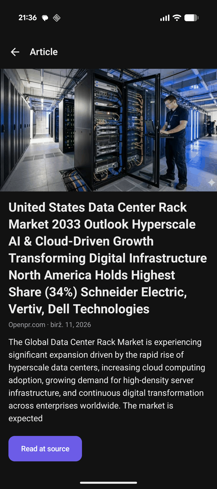
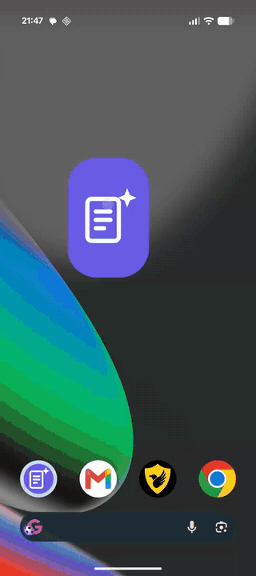
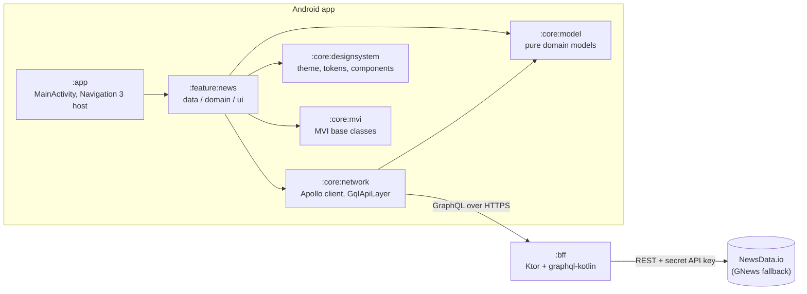

# AI News

[](https://github.com/baruckis/ai-news/actions/workflows/ci.yml)
[](https://codecov.io/gh/baruckis/ai-news)
[](LICENSE)

An open-source Android app that shows real AI news: list → tap → detail. A small, deliberately
polished demo of a modern Android engineering stack — built in public, stage by stage, each
stage reviewed before merge.

## Screenshots

| News list | Article detail | Tablet (two-pane) |
| --- | --- | --- |
|  |  |  |



## Tech stack

- **Kotlin** (K2), **Jetpack Compose**, **Navigation 3**
- **Clean Architecture** + best-practice **MVI** (UiState / Intent / Effect)
- **Multi-module** by feature
- **Apollo Kotlin 5** (GraphQL client) with normalized cache
- **Hilt** for dependency injection
- A **Kotlin BFF** (Ktor + graphql-kotlin) that hides the news-provider API key
- Custom **design system** (light + dark), **Coil** for images
- Tests: JUnit5, MockK, Turbine, Robolectric + Roborazzi, apollo-mockserver
- CI: GitHub Actions with quality (detekt, ktlint, Android Lint) and coverage (Kover) gates

## Architecture

The app talks GraphQL to its own small Kotlin backend (the BFF), which keeps the news
provider's API key secret and normalises provider quirks behind one stable schema.
Modules depend in one direction only — see [ARCHITECTURE.md](ARCHITECTURE.md) for the
full rationale (MVI, Clean Architecture layering, Navigation 3, the BFF's role).



Data flow for the core journey: the **list** screen sends a `Load` intent → use case →
repository → Apollo → **BFF** → **NewsData.io**; tapping an article emits a
`NavigateToDetail` effect, and the **detail** screen loads from the Apollo normalized
cache (or the BFF on a miss).

### Modules

```
:app                  Application, MainActivity, DI wiring (entry points only)
:core:model           pure-Kotlin domain models (no dependencies)
:core:mvi             MVI base (UiState / Intent / Effect / MviViewModel)
:core:network         Apollo GraphQL layer
:core:designsystem    theme, tokens, components
:core:testing         shared test helpers and fakes
:feature:news         news list + detail (data / domain / ui)
:bff                  Kotlin GraphQL BFF (Ktor + graphql-kotlin), separate from the Android build
```

Dependency rule: `:app → :feature:* → :core:*`; `:core:model` depends on nothing, and domain code
never depends on networking or UI frameworks.

## Building

Requires JDK 21 and the Android SDK (compileSdk 36).

```bash
# Copy the local config template and adjust if needed.
cp local.properties.example local.properties

# Assemble the debug app.
./gradlew :app:assembleDebug

# Run all quality and coverage gates (the same set CI runs).
./gradlew build detekt ktlintCheck lint test koverXmlReport koverVerify
```

`GRAPHQL_URL` is read from `local.properties` and exposed via `BuildConfig` — it is never
hard-coded or committed. The template defaults to the live production endpoint (see
[Deployment](#deployment)); switch to the emulator-localhost URL (`http://10.0.2.2:8080/graphql`)
to develop against a locally running BFF (see below).

## Run the BFF locally

The `:bff` module is a standalone Kotlin GraphQL server (Ktor + graphql-kotlin) that hides the
news-provider API key behind your own endpoint. It serves **real** AI news from
[NewsData.io](https://newsdata.io/) (with an optional [GNews](https://gnews.io/) fallback).

```bash
# 1. Provide your secrets (bff/.env is gitignored — never commit it).
cp bff/.env.example bff/.env
# edit bff/.env and set NEWSDATA_KEY=<your key from newsdata.io>

# 2. Start the server on http://localhost:8080 (reads bff/.env into the environment).
set -a; . bff/.env; set +a
./gradlew :bff:run        # or: ./gradlew :bff:buildFatJar && java -jar bff/build/libs/bff-all.jar

# 3. Query it.
curl -s http://localhost:8080/graphql \
  -H 'content-type: application/json' \
  -d '{"query":"{ aiNews { articles { id title sourceName publishedAt } } }"}'
```

Open `http://localhost:8080/graphiql` for the interactive explorer, or `GET /sdl` for the schema.
The key is read only from the environment (`NEWSDATA_KEY`); `NEWS_TIMEFRAME` is optional and
requires a paid NewsData plan, so the free tier returns the latest news by default.

## Performance

The UI layer is tuned for recomposition efficiency, and the release build ships ahead-of-time
compilation hints:

- **Compose stability** — screen states are `@Immutable` and carry
  [`kotlinx.collections.immutable`](https://github.com/Kotlin/kotlinx.collections.immutable) lists;
  the pure-Kotlin domain models are declared stable via a compiler stability configuration
  ([`config/compose/stability.conf`](config/compose/stability.conf)) so they stay free of Compose
  dependencies. Strong skipping is enabled explicitly. The compiler's stability reports are
  committed under [`docs/compose-metrics/`](docs/compose-metrics/) and can be regenerated with
  `./gradlew assembleRelease -PcomposeCompilerReports`.
- **Lazy list hygiene** — the article list uses item `key`s and a `contentType`, a hoisted
  `LazyListState`, and `derivedStateOf` for scroll-derived UI so flinging invalidates as little
  as possible.
- **Images** — an app-wide Coil `ImageLoader` with explicit memory (25 %) and disk (50 MB) caches,
  crossfade and a branded placeholder; layout constraints give every request an exact decode size.
- **Release build** — R8 full mode with resource shrinking.
- **Baseline Profile** — generated by the `:benchmark` module on a Gradle Managed Device and
  compiled into the release build at install time.

### Benchmarks

The [`:benchmark`](benchmark/) Macrobenchmark module measures cold/warm startup
(`StartupTimingMetric`) and list-fling frame timing (`FrameTimingMetric`), each with JIT only
(`CompilationMode.None`) and with the baseline profile applied (`CompilationMode.Partial`). Both
run on a Gradle Managed Device (Pixel 6, API 34, AOSP image), so no physical device is needed:

```bash
# Generate the baseline profile (writes app/src/release/generated/baselineProfiles/).
./gradlew :app:generateBaselineProfile

# Run the macrobenchmarks on the managed device.
./gradlew :benchmark:pixel6Api34BenchmarkReleaseAndroidTest
```

Measured on the managed device (Pixel 6 profile, API 34 AOSP emulator, Apple M4 Pro host);
10 iterations for startup, 5 for scroll:

| Benchmark | No profile | Baseline profile |
| --- | --- | --- |
| Cold startup — time to initial display (median) | 301.3 ms | 317.6 ms |
| Warm startup — time to initial display (median) | 90.9 ms | 84.4 ms |
| List fling — frame duration P50 | 17.7 ms | 17.9 ms |
| List fling — frame overrun P99 | 51.1 ms | 37.6 ms |

> Real measurements, not estimates. On an emulator the JIT-vs-AOT gap is muted and
> run-to-run variance is high (the cold-start medians above overlap within it), so these
> numbers are useful for relative comparison only; baseline-profile gains are typically
> clearer on physical hardware. Rerun the commands above to reproduce.

## Deployment

The BFF is live at **https://ainews-api.baruckis.com/graphql** — it runs as a Docker container
on a VPS, behind a reverse proxy that terminates TLS. The Android app points at this endpoint by
default (`local.properties.example`).

```bash
curl https://ainews-api.baruckis.com/graphql \
  -H 'content-type: application/json' \
  -d '{"query":"{ aiNews { articles { id title sourceName } } }"}'
```

The [`deploy/`](deploy/) directory contains a reproducible, self-contained reference setup
(Docker Compose + Caddy) you can use to host your own instance — see
[deploy/README.md](deploy/README.md).

## Status — planned stages

Built in numbered stages; each stage is a single reviewed pull request.

- [x] **Stage 0** — Repo bootstrap, multi-module Gradle skeleton, CI with quality + coverage gates
- [x] **Stage 1** — Design system (light/dark theme, tokens, components)
- [x] **Stage 2** — Kotlin BFF (Ktor + graphql-kotlin) serving real AI news
- [x] **Stage 3** — BFF deployment
- [x] **Stage 4** — `:core:network` (Apollo Kotlin 5, normalized cache)
- [x] **Stage 5** — `:core:mvi` + `:core:model`
- [x] **Stage 6** — `:feature:news` data + domain
- [x] **Stage 7** — News list screen
- [x] **Stage 8** — Article detail + Navigation 3
- [x] **Stage 9** — Polish, adaptive layout, accessibility
- [x] **Stage 10** — Performance: Compose stability, baseline profiles and macrobenchmarks
- [x] **Stage 11** — Documentation (architecture docs, diagrams, screenshots) and final QA

## Contributing

See [CONTRIBUTING.md](CONTRIBUTING.md). Conventional commits, Kotlin official style, and tests for
new logic are expected.

## License

[MIT](./LICENSE) © 2026 Andrius Baruckis
